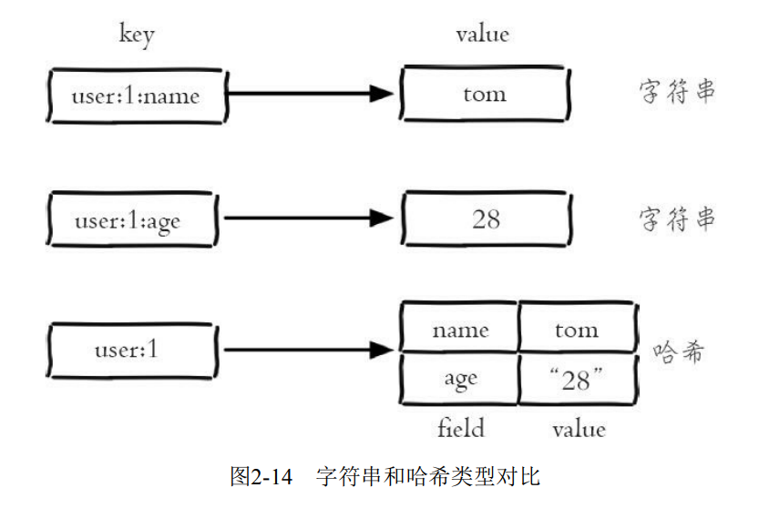
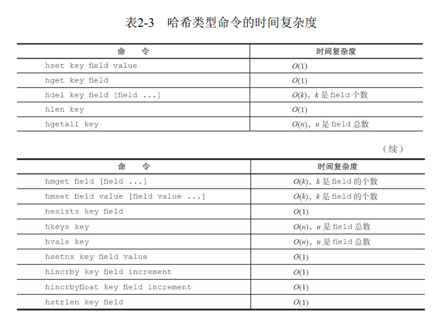
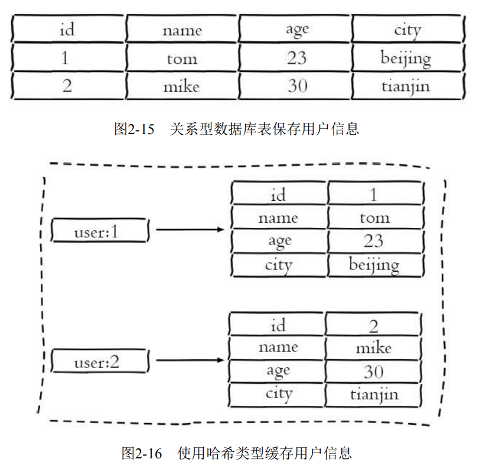

[TOC]

# 概览

>哈希类型是指键值本身又是一个键值对结构，
>形如value={{field1，value1}，...{fieldN，valueN}}



# 命令

1. 设置值

```cli
hset key field value
```

设置成功会返回1，反之会返回0
Redis 提供了 hsetnx命令，它们的关系就像 set和setnx命令一样，只不过作用域由键变成field。

2. 获取值

```cli
hget key field
```

如果键或field不存在，会返回nil;

3. 删除 field

```cli
 hdel key field [field ...]
```

hdel 会删除一个或多个 field，返回结果为成功删除field的个数。

4. 计算field个数

```cli
hlen key
```

6. 批量设置或获取 field-value

```cli
hmget key field [field ...]
hmset key field value [field value]
```

>hmset 和 hmget 分别是批量设置和获取 field-value, hmset 需要的参数是key 和多对field-value, hmget 需要的参数是 key和多个field.

8. 判断 field是否存在

```cli
hexists key field
```

>存在返回结果1，不包含时返回0：

10. 获取所有 field

```cli
hkeys key
```

>hkeys 命令应该叫hfields 更为恰当，它返回指定哈希键所有的fields

12. 获取所有value

```cli
hvals key
```

14. 获取所有的field-value

```cli
hgetall key
```

**注意**
>在使用hgetall时，如果哈希元素个数比较多，会存在阻塞Redis的可能。
>如果开发人员只需要获取部分field,可以使用hmget。
>如果一定要获取全部 field-value,可以使用hscan命令，该命令会渐进式便利哈希类型。

16. hincrby hincrbyfloat

```cli
hincrby key field
hincrbyfloat key field
```

>hincrby和hincrbyfloat，就像incrby和incrbyfloat命令一样，但是它们的作用域是filed。

18. 计算value的字符串长度

```cli
hstrlen key field
```

20. 哈希类型命令的时间复杂度


# 内部编码

- ziplist(压缩列表)：

>当哈希类型元素小于 hash-max-ziplist-entries配置（默认512）、同时所有指都小于hash-max-ziplist-value 配置（默认64个字节）时，Redis会使用ziplist作为哈希的内部实现。，ziplist使用更加紧凑的结构实现多个元素的连续存储，所以在节省内存方面比hashtable更加优秀。

- listpack(紧凑列表)

>这个是从ziplist->quicklist->listpack 一步步演变的
>它的特点就是用一块连续的内存空间来紧凑地保存数据，同时为了节省内存空间，listpack 列表项使用了多种编码方式，来表示不同长度的数据，这些数据包括整数和字符串。

- hashtable(哈希表)

>当哈希类型无法满足ziplist的条件时，Redis会使
用hashtable作为哈希的内部实现，因为此时ziplist的读写效率会下降，而
hashtable的读写时间复杂度为O（1）。

# 使用场景

关系型数据表记录的两条用户信息

**注意**

- 哈希类型是稀疏的，而关系型数据库是完全结构化的，例如哈希类型
每个键可以有不同的field，而关系型数据库一旦添加新的列，所有行都要为
其设置值（即使为NULL）。

- 关系型数据库可以做复杂的关系查询，而Redis去模拟关系型复杂查询
开发困难，维护成本高。

**三种方法缓存用户信息**

1. 原生字符串类型 （String）

```cli
set u:1:name tom
set u:1:age 23
set u:1:city fuzhou
```

优点：简单直观，每个属性都支持更新操作
缺点：占用过多的键，内存占用率较大，同时用户信息内聚性比较差，所以此种方案一般不会在生产环境使用。

2. 序列化字符串类型 (将用户信息序列化后用一个键保存)

```cli
set u:1 serialize(userinfo)
```

优点：简化编程，如果合理的使用序列化可以提交内存的使用率
缺点：序列化和反序列化有一定的凯西奥，同时每次更新属性都需要把全部数据取出进行反序列化，更新后在序列化到Redis中。

3. 哈希类型：每个用户属性使用一对field-value,但是只用一个键保存。

```cli
hmset u:1 name tom age 13 city fuzhou 
```

优点： 简单直观，如果使用合理可以减少内存空间的使用。
缺点：要控制哈希在listpack和hashtable两种内部编码的转换，hashtable 会消耗更多内存。
