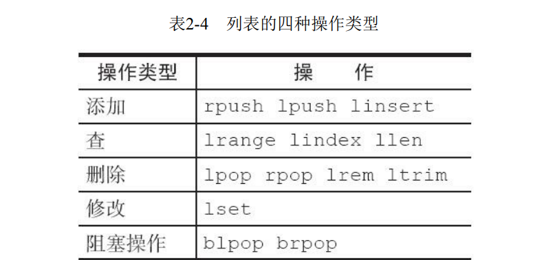
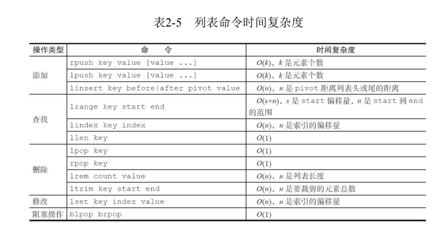

[toc]

# 概览

>列表类型是用来存储多个有序的字符串，如 a、b、c、d、e 五个元素从左到右组成了一个有序的列表，列表中的每个字符串称为元素（element）,一个列表最多可以存储 2^32^-1 个元素。在Redis中，可以对列表两端插入（push）和弹出（pop），还可以获取指定范围的元素列表、获取指定索引下标的元素等。

>列表是一种比较灵活的数据结构，它可以充当栈和队列。
>列表中的元素是有序的，可以通过索引下标获取某个元素或者某个范围内的元素列表。

>列表中的元素可以是重复的。

# 命令



1. 添加操作
1.1 从右边操作

```cli
rpush key value [value ...]

```

1.2 从左到右获取列表的所有元素

```cli
lrange key 0 -1
```

1.3 从左边插入元素

```cli
lpush key value [value]
```

1.4 向某个元素前或者后插入元素

```cli
linsert key before|after pivot value
```

linsert命令会从列表中找到等于pivot的元素，在其前（before）或者后
（after）插入一个新的元素value

2. 查找

2.1 获取指定范围内的元素列表

```cli
lrange key start end
```

>lrange操作会获取列表指定索引范围所有的元素。
>索引下标有两个特点：第一，索引下标从左到右分别是0到N-1，但是从右到左分别是-1到-N。
>第二，lrange中的end选项包含了自身，这个和很多编程语言不包含end不太
相同，例如想获取列表的第2到第4个元素，

2.2 获取列表指定索引下标的元素

```cli
lindex key index
```

2.3 获取列表长度

```cli
llen key
```

3. 删除

3.1 从列表左侧弹出元素

```cli
lpop key
```

> 列表最左侧的元素会被弹出

3.2 从列表右侧弹出

```cli
rpop key
```

>列表最右侧的元素会被弹出

3.3 删除指定元素

```cli
lrem key count value
```

>lrem命令会从列表中找到等于value的元素进行删除，根据count的不同
分为三种情况：
・count>0，从左到右，删除最多count个元素。
・count<0，从右到左，删除最多count绝对值个元素。
・count=0，删除所有。

3.4 按照索引范围修建列表

```cli
ltrim key start end
```

只会保留 key 的第start+1个到end+1个元素。

4. 修改

修改指定元素下标的元素

```cli
lset key index newvalue
```

5. 阻塞操作

```cli
blpop key [key ...] timeout
brpop key [key ...] timeout
```

>blpop和brpop是lpop和rpop的阻塞版本，它们除了弹出方向不同，使用
方法基本相同，所以下面以brpop命令进行说明，brpop命令包含两个参数：
・key[key...]：多个列表的键。
・timeout：阻塞时间（单位：秒）。

1） 列表为空：如果 timeout=3,那么客户端要等到3秒后返回，如果 timeout=0,那么客户端一直阻塞等下去：

2） 列表不为空：客户端会立即返回
**注意**
在使用 brpop时，有两点需要注意
第一点，如果是多个键，那么brpop 会从左至右遍历键，一旦有一个键能弹出元素，客户端立即返回：

第二点，如果多个客户端对同一个键执行brpop,那么最先执行brpop命令的客户端可以获取到弹出的值。

6. 列表命令时间复杂度



# 内部编码

列表内部编码有两种

>・ziplist（压缩列表）：当列表的元素个数小于list-max-ziplist-entries配置（默认512个），同时列表中每个元素的值都小于list-max-ziplist-value配置时（默认64字节），Redis会选用ziplist来作为列表的内部实现来减少内存的使用。
>linkedlist（链表）：当列表类型无法满足ziplist的条件时，Redis会使用
linkedlist作为列表的内部实现。

1)当元素个数较少且没有大元素时，内部编码为(quicklist)(ziplist):
2)当元素个数超过512个或者当某个元素超过64字节,内部编码也会变为linkedlist

# 使用场景

1. 消息队列
>Redis的lpush+brpop命令组合即可实现阻塞队列，生产
者客户端使用lrpush从列表左侧插入元素，多个消费者客户端使用brpop命令
阻塞式的“抢”列表尾部的元素，多个客户端保证了消费的负载均衡和高可用
性。

3. 文章列表

>每个用户有属于自己的文章列表，现需要分页展示文章列表。此时可以
考虑使用列表，因为列表不但是有序的，同时支持按照索引范围获取元素。

**注意**
使用列表类型保存和获取文章列表会存在两个问题。第一，如果每次分
页获取的文章个数较多，需要执行多次hgetall操作，此时可以考虑使用
Pipeline（第3章会介绍）批量获取，或者考虑将文章数据序列化为字符串类
型，使用mget批量获取。第二，分页获取文章列表时，lrange命令在列表两
端性能较好，但是如果列表较大，获取列表中间范围的元素性能会变差，此
时可以考虑将列表做二级拆分，或者使用Redis3.2的quicklist内部编码实现，
它结合ziplist和linkedlist的特点，获取列表中间范围的元素时也可以高效完
成。


**开发提示**

实际上列表的使用场景很多，在选择时可以参考以下口诀：

・lpush+lpop=Stack（栈）
・lpush+rpop=Queue（队列）
・lpush+ltrim=Capped Collection（有限集合）
・lpush+brpop=Message Queue（消息队列）