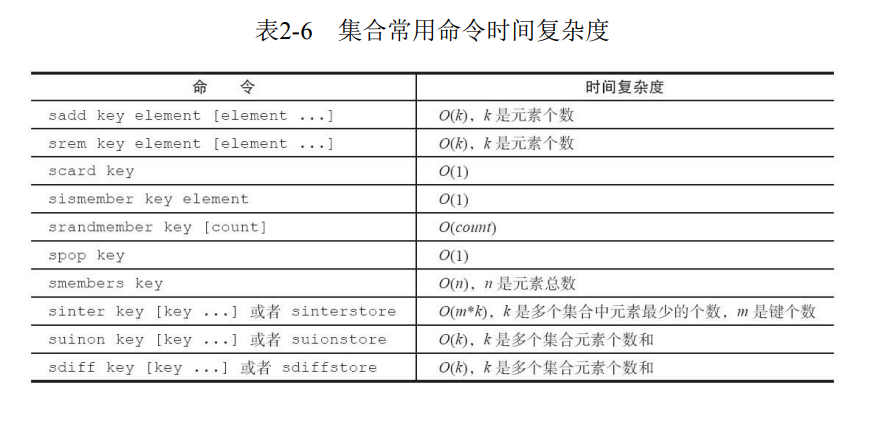

[toc]

# 概览

>集合（set）类型也是用来保存多个的字符串元素，但和列表类型不一
样的是，集合中不允许有重复元素，并且集合中的元素是无序的，不能通过
索引下标获取元素。
一个集合最多可以存储 2^32^-1个元素。
Redis除了支持集合内的增删改查，同时还支持多个集合取交集、并
集、差集。

1. 集合内操作

1.1 添加元素

```cli
sadd key element [element ...]
```

返回结果为添加成功的元素个数
1.2 删除元素

```cli
srem key element [element]
```

返回结果为成功删除元素个数

1.3 计算元素个数

```cli
scard key
```

scard的时间复杂度为O（1），它不会遍历集合所有元素，而是直接用
Redis内部的变量

1.4 判断元素是否在集合中

```cli
sismember key element
```

如果给定元素element在集合内返回1，反之返回0

1.5 随机从集合返回指定元素个数

```cli
srandmember key [count]
```

[count]是可选参数，如果不写默认为1，

1.6 从集合随机弹出元素

```cli
spop key
```

spop操作可以从集合中随机弹出一个元素
srandmember和spop都是随机从集合选出元素，两者不同的是spop命令
执行后，元素会从集合中删除，而srandmember不会。

1.7 获取所有元素

```cli
smembers key
```

获取集合所有元素，并且返回结果是无序的。

**注意**

>smembers和lrange、hgetall都属于比较重的命令，如果元素过多存在阻
塞Redis的可能性，这时候可以使用sscan来完成

2. 集合间操作

2.1 求多个集合交集

```cli
sinter key [key ...]
```

2.2 求多个集合的并集

```cli
sunion key [key ...]
```

2.3 求多个集合的差集

```cli
sdiff key [key ...]
```

这里的差集是以第一个key为准

2.4 将交集、并集、差集的结果保存

```cli
sinterstore destination key [key...]
sunionstore destination key [key...]
sdiffstore  destination key [key...]
```

>集合间的运算在元素较多的情况下会比较耗时，所以Redis提供了上面
三个命令（原命令+store）将集合间交集、并集、差集的结果保存在
destination key中。



# 内部编码

集合裂隙的内部编码有两种：

- intset（整数集合）：当集合中的元素都是整数且元素个数小于set-max-intset-entries配置（默认512个）时，Redis会选用intset来作为集合的内部实
现，从而减少内存的使用。
- hashtable（哈希表）：当集合类型无法满足intset的条件时，Redis会使
用hashtable作为集合的内部实现。

1）当元素个数较少且都为整数时，内部编码为intset：
2.1）当元素个数超过512个，内部编码变为hashtable：
2.2)当某个元素不为整数时，内部编码也会变为hashtable

# 使用场景

>集合类型比较典型的使用场景是标签（tag）。

(1) 给用户添加标签

```cli
sadd u:1:tags tag1 tag2 tag3
sadd user:2:tags tag2 tag3 tag5
...
sadd user:k:tags tag1 tag2 tag4
```

(2) 给标签添加用户

```cli
sadd tag1:users user:1 user:3
sadd tag2:users user:1 user:2 user:3
...
sadd tagk:users user:1 user:2
...
```

用户和标签的关系维护应该在一个事务内执行，防止部分命令失败造成的数据不一致，有关如何将两个命令放在一个事务.

**开发提示**

集合类型的应用场景通常为以下几种：
・sadd=Tagging（标签）
・spop/srandmember=Random item（生成随机数，比如抽奖）
・sadd+sinter=Social Graph（社交需求）
