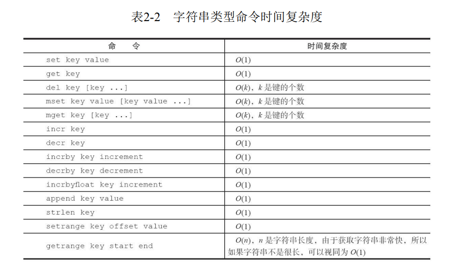

[TOC]

# String 常用命令

1. 设置值

```cli
set key value [ex seconds] [px milliseconds] [nx|xx]
```

set 命令有几个选项

- ex seconds:为键设置秒级过期时间
- px milliseconds：为键设置毫秒级过期时间
- nx:键必须不存在，才可以设置成功，用于添加
- xx:与nx相反，键必须存在，才可以设置成功，用于更新。
  
除了 set 选项，Redis还提供了setex和setnx两个命令：它们的作用和ex和nx选项是一样的。

```cli
setex key seconds value
setnx key value
```

setnx可以作为分布式锁的一种实现方案。

2. 获取值

```cli
get key
```

3. 批量设置值

```cli
mset key value [key value]
```

5. 批量获取值

```cli
mget key [key ...]
```

批量操作优点：
有助于提供业务处理效率，但是要注意的是每次批量操作所发送的命令数不是无节制的，如果数量过多可能造成Redis阻塞或者网络拥塞。

6. 计数

```cli
incr key
```

incr 命令用于对值做自增操作，返回结果分为三种情况：

- 值不是整数，返回错误
- 值是整数，返回自增后的结果
- 键不存在，按照值为0自增，返回结果1。

除了incr 命令，Redis 提供了decr（自增）、incrby(自增指定数字)、
decrby(自减指定数字)、incrbyfloat(自增浮点数)：

7. 追加值

```cli
append key value
```

8. 字符串长度

```cli
strlen key
```

每个中文占用3个字符

10. 设置并返回原值

```cli
getset key value
```

getset 和set 一样会设置值 但是不同的是，它同时会返回键原来的值

12. 设置指定位置的字符

```cli
setrange key offset value
```

14. 获取部分字符串

```cli
getrange key start end
```

start 和end 分别是开始和结束的偏移量，偏移量从0开始计算

16. 字符串类型命令时间复杂度



# 内部编码

字符串类型的内部编码有3种

- int:8个字节的长整型
- embstr:小于等于39个字节的字符串
- raw:大于39个字节的字符串

# 典型使用场景

1. 缓存功能

> 开发提示：设计合理的键名，有利于防止键冲突和项目的可维护性
> redis 比较推荐键名的命名的方式：业务名:对象名: id:[属性] 作为键名
> 如果键名比较长，可以适当减少键的长度，
> 如user:{uid}:friends:messages:{mid}->u:{uid}: fr: m:{mid}
> 从而减少由于键过长的内存浪费。

2. 计数

incr key value

实际上一个真实的计数系统要考虑的问题会很多：防作弊、按照不同维度计数，数据持久化到底层数据源等。

3. 共享session


4. 限速
