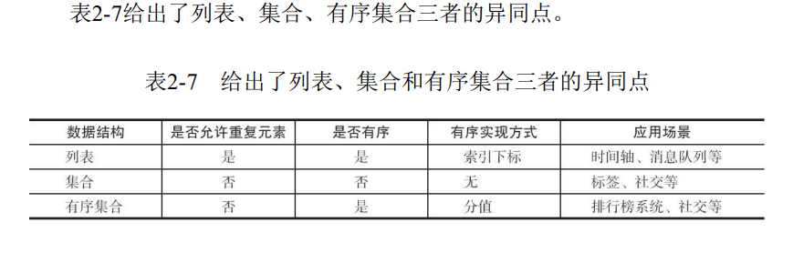
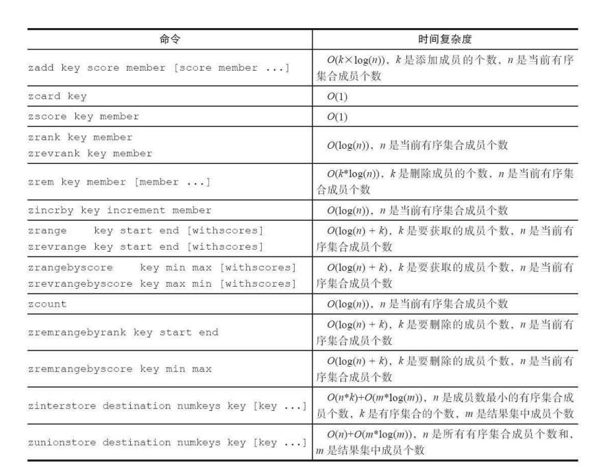

[TOC]

# 概览

>有序集合不能有重复成员且有序集合中的元素可以排序。但是和列表使用索引下标作为排序依据不同的是，它给每个元素设置一个分数（score）作为排序的依据。
>有序集合厚葬的元素不能重复，但是score可以重复。




# 命令

1. 集合内
（1）添加成员

```cli
zadd key score memeber [score memeber ...]
```

有关zadd命令有两点需要注意：

- zadd 命令添加了nx、xx、ch、incr 四个选项：
  - nx:member必须不存在，才可以设置成功，用于添加。
  - xx:member必须存在，才可以设置成功，用于更新。
  - ch:返回此次操作后，有序集合元素和分数发生变化的个数
  - incr:对score做增加，相当于后面价绍的zincrby。
- 有序集合相比集合提供了排序字段，但也有代价，zadd的时间复杂度为O(log(n)),sadd的时间复杂度为O(1).

(2) 计算成员个数

```cli
zcard key
```

(3) 计算某个成员的分数

```cli
zscore key member
```

(4) 计算成员的排名

```cli
zrank key member
zrevrank key member

```

zrank是从分数从低到高返回排名，zrevrank从高到底返回排名。
(排名从0开始计算)

（5） 删除成员

```cli
zrem key member [member ...]
```

（6）增加成员的分数

```cli
zincrby key increment member
```

(7) 返回指定排名范围的成员

```cli
zrange key start end [withscores]
zrevrange key start end [withscores]
```

有序集合是按照分值排名的，zrange 是从低到高返回，zrevrange从高到低返回。如果加上withscore选项，同时会返回成员的分数。

(8) 返回指定分数范围的成员

```cli
zrangebyscore key min max [withscores] [limit offset count]
zrevrangebyscore key max min [withscores] [limit offset count]
```

其中zrangebyscore 按照分数从低到高返回，zrevrangebyscore从高到低返回。 withscores选项会同时返回每个成员的分数。[limit offset count] 选项可以限制输出的起始位置和个数。

同时 min和max 还支持开区间（小括号）和闭区间（中括号），-inf 和+inf分别代表无限小和无限大

(9) 返回指定分数范围成员个数

```cli
zcount key min max
```

(10)删除指定排名内的升序元素

```cli
zremrangebyrank key start end
```

(11) 删除指定分数范围的成员

```cli
zremrangebysocre key min max
```

2. 集合间的操作

(1)交集

```cli
zinterstore destination numkeys key [key ...] [weights weight [weight] [aggregate sum|min|max]
```

这个命令参数较多，下面粉笔进行说明：

- destination: 交集计算结果保存到这个键
- numkeys:需要做交集计算见的个数
- key[key ...]:需要做交集计算的键。
- weights weight[weight...]：每个键的权重，在做交集计算时，每个键中
的每个member会将自己分数乘以这个权重，每个键的权重默认是1。
- aggregate sum|min|max：计算成员交集后，分值可以按照sum（和）、
min（最小值）、max（最大值）做汇总，默认值是sum。

让user：ranking：2的权重变为0.5，并且聚合效果使用max，可以
执行如下操作：

```cli
zinterstore user:ranking:1_inter_2 2 user:ranking:1
user:ranking:2 weights 1 0.5 aggregate max
```

(2)并集

```cli
zunionstore desctination numkeys key [key ...] [weight weight [weight ...]] [aggregate sum|min|max]
```



# 内部编码

有序集合类型的内部编码有两种：

- ziplist(压缩列表)（新版已经变成listpack）：
当有序集合的元素个数小于zset-max-ziplistentries配置（默认128个），同时每个元素的值都小于zset-max-ziplist-value配
置（默认64字节）时，Redis会用ziplist来作为有序集合的内部实现，ziplist
可以有效减少内存的使用。

- skiplist(跳跃表)：
当ziplist条件不满足时，有序集合会使用skiplist作
为内部实现，因为此时ziplist的读写效率会下降。

# 使用场景

>有序集合比较典型的使用场景就是排行版系统。

（1）添加用户赞数

```cli
zadd user:ranking:20160315 score member
```

(2)取消用户赞数

```cli
zincrby user:ranking:20160315  increment member
```

(3) 展示获取赞数最多的十个用户

```cli
zrevrangebyrank user:ranking:20160315 0 9 withscores
```

(4)展示用户信息以及用户分数

```cli
hgetall user:info:tom
zscore user:ranking:20160315 mike
zrank user:ranking:20160315 mike
```
