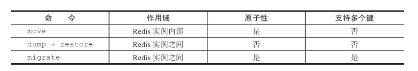

[toc]

# 单个键管理

1. 键冲命名

```cli
rename key newkey
```

如果在rename之前，键java已经存在，那么它的值也将被覆盖。
为了防止被强行rename，Redis提供了renamenx命令，确保只有newKey
不存在时候才被覆盖。

>在使用重命名命令时，有两点需要注意：

- 为了防止被强行rename，Redis提供了renamenx命令，确保只有newKey
不存在时候才被覆盖，
- 如果rename和renamenx中的key和newkey如果是相同的，在Redis3.2和之
前版本返回结果略有不同。

2. 随机返回一个键

```cli
randomkye
```

3. 键过期

- expire key seconds:键在seconds秒后过期
- expireat key timestamp: 键在秒级时间戳timestamp后过期。
- ttl命令和pttl都可以查询键的剩余过期时间，但是pttl精度更高可以达到
毫秒级别，有3种返回值：
- 大于等于0的整数：键剩余的过期时间（ttl是秒，pttl是毫秒）。
- -1：键没有设置过期时间。
- -2：键不存在。

- pexpire key milliseconds：键在milliseconds毫秒后过期。
- pexpireat key milliseconds-timestamp键在毫秒级时间戳timestamp后过
期。
但无论是使用过期时间还是时间戳，秒级还是毫秒级，在Redis内部最
终使用的都是pexpireat。

1）如果expire key的键不存在，返回结果为0：
2）如果过期时间为负值，键会立即被删除，犹如使用del命令一样：
3）persist命令可以将键的过期时间清除：
4）对于字符串类型键，执行set命令会去掉过期时间。
5）Redis不支持二级数据结构（例如哈希、列表）内部元素的过期功
能，例如不能对列表类型的一个元素做过期时间设置。
6）setex命令作为set+expire的组合，不但是原子执行，同时减少了一次
网络通讯的时间。

4. 迁移键

(1)move

```cli
move key db
```

move key db就是把指定的键从源数据库移动到目标数据库中
(2) dump+restore

```cli
dump key 
restore key ttl value
```

dump+restore可以实现在不同的Redis实例之间进行数据迁移的功能，整
个迁移的过程分为两步：
1）在源Redis上，dump命令会将键值序列化，格式采用的是RDB格式。
2）在目标Redis上，restore命令将上面序列化的值进行复原，其中ttl参
数代表过期时间，如果ttl=0代表没有过期时间。

(3) migrate

```cli
migrate host port key|"" destination-db timeout [copy][replace][keys key [key ...]]
```

migrate命令也是用于在Redis实例间进行数据迁移的，实际上migrate命
令就是将dump、restore、del三个命令进行组合，从而简化了操作流程。
migrate命令具有原子性，而且从Redis3.0.6版本以后已经支持迁移多个键的
功能，有效地提高了迁移效率，migrate在10.4节水平扩容中起到重要作用。

下面对migrate的参数进行逐个说明：

- host：目标Redis的IP地址。
- port：目标Redis的端口。
- key|""：在Redis3.0.6版本之前，migrate只支持迁移一个键，所以此处是
要迁移的键，但Redis3.0.6版本之后支持迁移多个键，如果当前需要迁移多
个键，此处为空字符串""。
- destination-db：目标Redis的数据库索引，例如要迁移到0号数据库，这里就写0.
- timeout：迁移的超时时间（单位为毫秒）。
- [copy]：如果添加此选项，迁移后并不删除源键。
- [replace]：如果添加此选项，migrate不管目标Redis是否存在该键都会
正常迁移进行数据覆盖。
- [keys key[key...]]：迁移多个键，例如要迁移key1、key2、key3，此处填
写“keys key1 key2 key3”。

下面用示例演示migrate命令，为了方便演示源Redis使用6379端口，目
标Redis使用6380端口，现要将源Redis的键hello迁移到目标Redis中，会分为
如下几种情况：

情况1：源Redis 有键hello,目标Redis没有：

```cli
migrate 127.0.0.1 6380 hello 0 1000
```

情况2：源Redis和目标Redis 都有键hello：

```cli
migrate 127.0.0.1 6379 hello 0 1000 replace
```

情况3：源Redis 执行多个键迁移

```cli
migrate 127.0.0.1 6380 "" 0 5000 keys key1 key2 key3
```

- move、dump+restore、migrate 三种迁移方式的异同点。



2.7.2 遍历键

1. 全量遍历键

```cli
keys pattern
```

实际上keys命令是支持pattern匹配.
pattern直接使用星号，这是因为pattern使用的是glob风格的通配符：

- *代表匹配任何字符。
- .代表匹配一个字符
- []代表匹配部分字符，例如 [1,3]代表匹配1，3，[1-10]代表匹配1-10的任意数字。
- \x用来做转义，例如要匹配星号、问号需要进行转义。

>建议不要使用keys 可以使用scan命令渐进式的遍历所有键。
>如果一定要使用的话建议在一个不对外提供服务的Redis节点。但是会影响到主从复制。
>键值比较少的实例上。

2. 渐进式遍历

```cli
scan cursor [match pattern] [count number]
```

- cursor是必需参数，实际上cursor是一个游标，第一次遍历从0开始，每
次scan遍历完都会返回当前游标的值，直到游标值为0，表示遍历结束。
- match pattern是可选参数，它的作用的是做模式的匹配，这点和keys的
模式匹配很像。
- count number是可选参数，它的作用是表明每次要遍历的键个数，默认
值是10，此参数可以适当增大。

```cli
hscan cursor [match pattern] [count number]
sscan cursor [match pattern] [count number]
zscan cursor [match pattern] [count number]
```

2.7.3 数据库管理

1. 切换数据库

```cli
select dbIndex
```

Redis默认配置中是有16个数据库
默认进到0号数据库。

- Redis是单线程。如果使用多个数据库，那么这些数据库仍然是使用一个CPU,彼此之间还是会受到影响。
- Redis的分布式实现Redis Cluster只允许使用0号数据库。
- 多数据库的使用方式，会让调试和运维不同业务的数据库变的困难。假如有一个慢查询存在，依然会影响其他数据库，这样会使得别的业务方定
位问题非常的困难。
- 部分Redis的客户端根本就不支持这种方式。
- 笔者建议如果要使用多个数据库功能，完全可以在一台机器上部署多个
Redis实例，彼此用端口来做区分，因为现代计算机或者服务器通常是有多
个CPU的。这样既保证了业务之间不会受到影响，又合理地使用了CPU资
源。

2. flushdb/flushall

flushdb/flushall 命令用于清除数据库，两者的区别是 flushdb只清除当前数据库，flushall会清除所有数据库。

- flushdb/flushall 命令会将所有数据清除，一旦误操作后果不堪设想，可以通过 rename-command配置规避这个问题，以及如何在误操作后快速恢复数据。
- 如果当前数据库键值比较多，flushdb/flushall存在阻塞Redis的可能性。