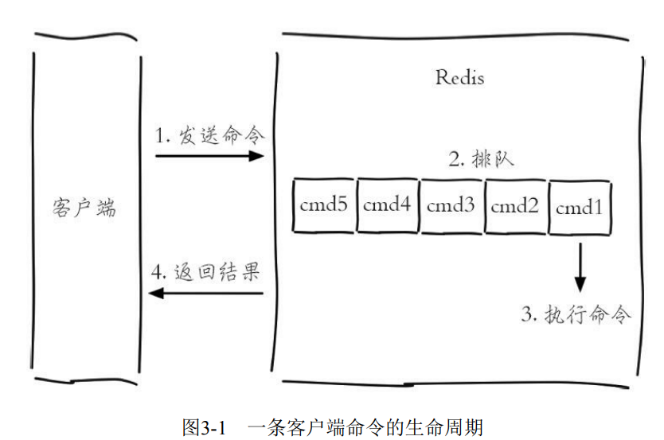
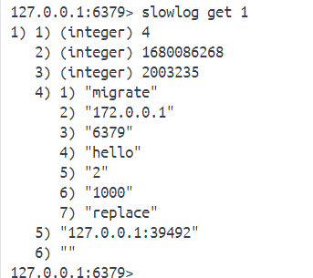
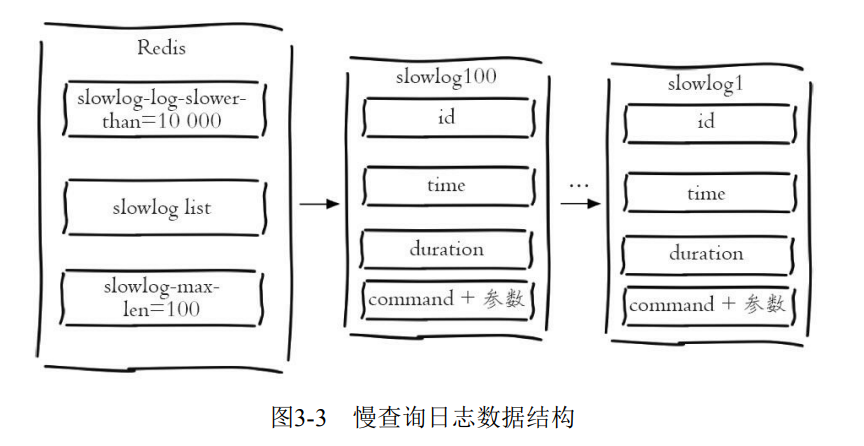

[toc]

# 慢查询分析

3.1 慢查询分析

>慢查询日志就是系统在命令执行前后计算每条命令的执行时间，当超过预设阈值，就将这条命令的相关信息（如：发生时间，耗时，命令的详细信息）记录下来。

Redis 客户端执行一条命令分为4个部分



1) 发送命令
2) 命令排队
3) 命令执行
4) 返回结果

**注意**

慢查询只统计步骤3的时间，所以没有慢查询并不代表客户端没有超时问题。

3.1.1 慢查询的两个配置参数

对于慢查询功能，需要明确两件事：

- 预设阈值怎么设置？
- 慢查询记录存放在哪？

Redis提供了slowlog-log-slower-than和slowlog-max-len配置来解决这两个问题。slowlog-log-slower-than就是那个预设阀值，它的单位是微秒（1秒=1000毫秒=1000000微秒），默认值是10000，假如执行了一条“很慢”的命令（例如keys*），如果它的执行时间超过了10000微秒，那么它将被记录在慢查询日志中。

**运维提示**

>如果slowlog-log-slower-than=0会记录所有的命令，slowlog-log-slowerthan<0对于任何命令都不会进行记录。

> slowlog-max-len只是说明了慢查询日志最多存储多少
条，并没有说明存放在哪里？实际上Redis使用了一个列表来存储慢查询日志，slowlog-max-len就是列表的最大长度。一个新的命令满足慢查询条件时被插入到这个列表中，当慢查询日志列表已处于其最大长度时，最早插入的一个命令将从列表中移出，例如slowlog-max-len设置为5，当有第6条慢查询插入的话，那么队头的第一条数据就出列，第6条慢查询就会入

> Redis 中有两种修改配置的方法，一种是修改配置文件，另一种是使用 config set 命令动态修改。例如下面使用config set命令将slowlog-log-slowerthan设置为20000微秒，slowlog-max-len设置为1000：

```cli
config set slowlog-log-slower-than 20000
config set slowlog-max-len 1000
config rewrite
```

如果要Redis将配置持久化到本地配置文件，需要执行config rewrite 命令。


## 使用命令来管理慢查询日志的访问和管理

(1) 获取慢查询日志

```cli
slowlog get [n]
```

每个慢查询日志有4个属性组成，分别是慢查询日志的标识id、发生时间戳、命令耗时、执行命令和参数。





(2) 获取慢查询日志列表当前长度

```cli
slowlog len
```

(3)慢查询日志重置

```cli
slowlog reset
```

实际是对列表做清理操作。

## 最佳实践

- slowlog-max-len配置建议：线上建议调大慢查询列表，记录慢查询时Redis会对长命令做截断操作，并不会占用大量内存。增大慢查询列表可以减缓慢查询被剔除的可能，例如线上可设置为1000以上。
- slowlog-log-slower-than配置建议：默认值超过10毫秒判定为慢查询，需要根据Redis并发量调整该值。由于Redis采用单线程响应命令，对于高流量的场景，如果命令执行时间在1毫秒以上，那么Redis最多可支撑OPS不到1000。因此对于高OPS场景的Redis建议设置为1毫秒。
- 慢查询只记录命令执行时间，并不包括命令排队和网络传输时间。因此客户端执行命令的时间会大于命令实际执行时间。因为命令执行排队机制，慢查询会导致其他命令级联阻塞，因此当客户端出现请求超时，需要检查该时间点是否有对应的慢查询，从而分析出是否为慢查询导致的命令级联阻塞。
- 由于慢查询日志是一个先进先出的队列，也就是说如果慢查询比较多的情况下，可能会丢失部分慢查询命令，为了防止这种情况发生，可以定期执行slow get命令将慢查询日志持久化到其他存储中（例如MySQL），然后可以制作可视化界面进行查询。


