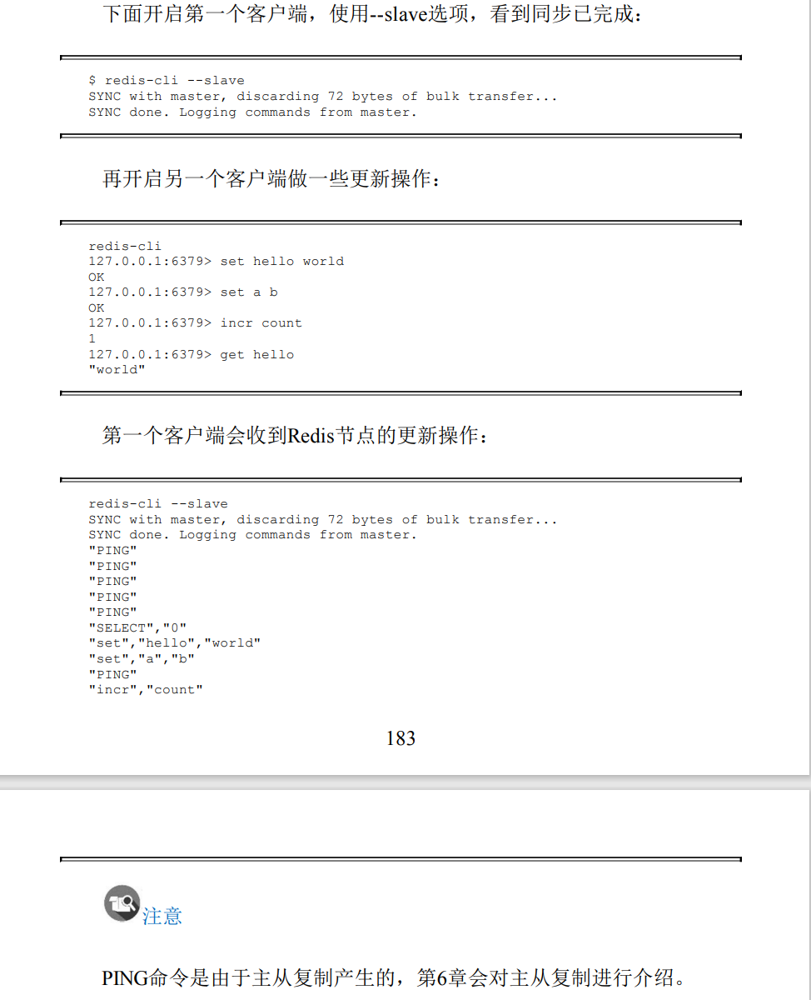

[toc]

# 概览

>Redis 提供了redis-cli、redis-server、redis-benchmark等shell工具。

1. -r

-r(repeat) 选项代表命令执行多次。例如下面操作将会执行三次ping
命令：

```cli
redis-cli -r 3 ping
```

2. -i

-i（interval）选项代表每隔几秒执行一次命令，但是-i选项必须和-r选项一起使用，下面的操作会每隔1秒执行一次ping命令，一共执行5次：

```cli
redis-cli -r 5 -i 1 ping
```

注意-i的单位是秒，不支持毫秒为单位，但是如果想以每隔10毫秒执行一次，可以用-i 0.01，例如：

```cli
redis-cli -r 5 -i 0.01 ping
```

利用-r和-i选项，每隔1秒输出内存的使用量，一共输出100次：

```cli
redis-cli -r 100 -i 1 info | grep used_memory_human
```

3.  -x

-x选项代表从标准输入（stdin）读取数据作为redis-cli的最后一个参数，例如下面的操作会将字符串world作为set hello的值：

```cli
echo "world" | redis-cli -x set hello
```

4.  -c

-c（cluster）选项是连接Redis Cluster节点时需要使用的，-c选项可以防止moved和ask异常.

5.  -a

如果Redis配置了密码，可以用-a（auth）选项，有了这个选项就不需要手动输入auth命令。

6.  --scan 和 --pattern

--scan选项和--pattern选项用于扫描指定模式的键，相当于使用scan命令。

7.  --slave

--slave选项是把当前客户端模拟成当前Redis节点的从节点，可以用来获取当前Redis节点的更新操作。

```cli
redis-cli --slave
```


8. --rdb

--rdb选项会请求Redis实例生成并发送RDB持久化文件，保存在本地。可使用它做持久化文件的定期备份。

9. --pipe

--pipe选项用于将命令封装成Redis通信协议定义的数据格式，批量发送给Redis执行。

10. --bigkeys

--bigkeys选项使用scan命令对Redis的键进行采样，从中找到内存占用比较大的键值，这些键可能是系统的瓶颈。

11. --eval

--eval选项用于执行指定Lua脚本

12. --latency

latency有三个选项，分别是--latency--latency-history、--latency-dist。它们都可以检测网络延迟，对于Redis的开发和运维非常有帮助。

(1) --latency
该选项可以测试客户端到目标Redis的网络延迟。

```cli
redis-cli -h {machineB} --latency

```

```cli
redis-cli -h {machineB} --latency
```

可以看到客户端A由于距离Redis比较远，平均网络延迟会稍微高一些。

(2) --latency-history
--latency的执行结果只有一条，如果想以分时段的形式了解延迟信息，可以使用--latency-history选项：

```cli
redis-cli -h 10.10.xx.xx --latency-history
```
可以看到延时信息每15秒输出一次，可以通过-i参数控制间隔时间。

(3)--latency-dist

该选项会使用统计图表的形式从控制台输出延迟统计信息。

13. --stat

--stat选项可以实时获取Redis的重要统计信息，虽然info命令中的统计信息更全，但是能实时看到一些增量的数据（例如requests）对于Redis的运维还是有一定帮助的。

```cli
redis-cli --stat
```

14. --raw和--no-raw

--no-raw选项是要求命令的返回结果必须是原始的格式，--raw恰恰相反，返回格式化后的结果。

```cli
redis-cli set hello "你好"
```

```cli
redis-cli --raw get hello
```

3.2.2 redis-server详解

redis-server除了启动Redis外，还有一个--test-memory选项。redis-server--test-memory可以用来检测当前操作系统能否稳定地分配指定容量的内存给Redis，通过这种检测可以有效避免因为内存问题造成Redis崩溃。

操作检测当前系统能够提供1G的内存给Redis：

```cli
redis-server --test-memory 1024
```

整个内存检测的时间比较长。当输出passed this test时说明内存检测完毕，最后会提示--test-memory只是简单检测，如果有质疑可以使用更加专业的内存检测工具：

3.2.3 redis-benchmark详解

redis-benchmark可以为Redis做基准性能测试。

1.-c
-c(clients)选项代表客户端的并发数量（默认是50）。
2.-n(requests)
-n(num)选项代表客户端请求总量（默认是100000）。
3.-q
-q选项仅仅显示redis-benchmark的requests per second信息。
4.-r
在一个空的Redis上执行了redis-benchmark会发现只有3个键：
如果想向Redis插入更多的键，可以执行使用-r（random）选项，可以向Redis插入更多随机的键。

```cli
redis-benchmark -c 100 -n 20000 -r 10000
```

5. -p

-P选项代表每个请求pipeline的数据量（默认为1）。

6. -k<boolean>

-k选项代表客户端是否使用keepalive，1为使用，0为不使用，默认值为1。

7. -t
-t选项可以对指定命令进行基准测试。

8. --csv
--csv 选项会将结果按照csv个数输出，便与后续处理。

```cli
redis-benchmark -t get,set --csv
```
