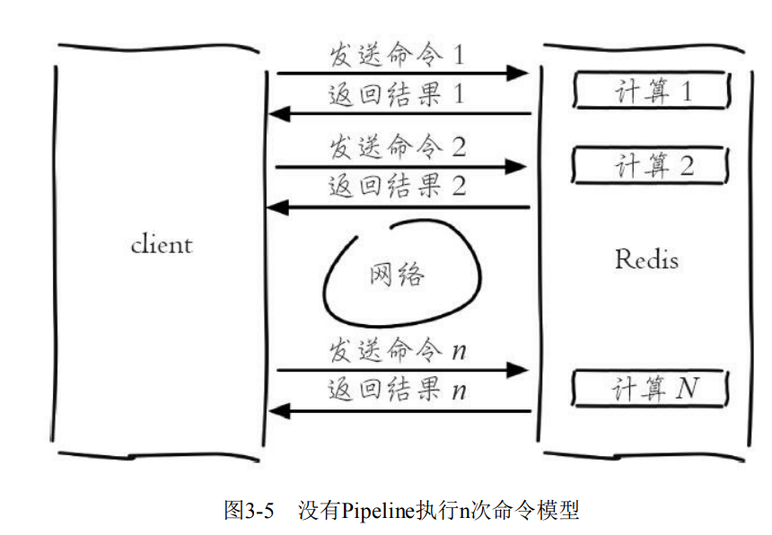
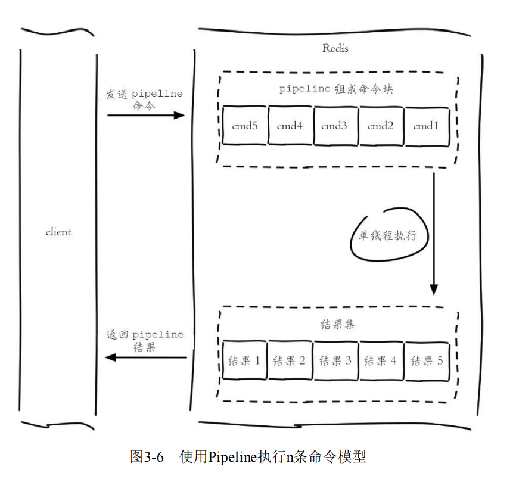
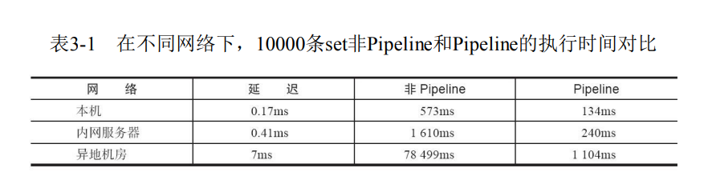

3.3 Pipeline

3.3.1 Pipeline概念
Redis客户端执行一条命令分为如下四个过程：
1）发送命令
2）命令排队
3）命令执行
4）返回结果
其中 1）+4）称为 Round Trip Time (RTT,往返时间)。

Redis 提供了批量操作命令（如mget,mset等）,有效地节约RTT。


Pipeline（流水线）机制。它能将一组Redis命令进行组装，通过一次RTT传输给Redis,再将这组Redis命令的执行结果按顺序返回给客户端。
图3-5 如果没有使用Pipeline执行了n条命令，整个过程需要n次RTT。



图3-6 使用Pipeline执行n次命令，整个过程需要1次RTT



redis-cli的--pipe选项实际上就是使用Pipeline机制，例如下面操作将set
hello world和incr counter两条命令组装：

```cli
echo -en '*3\r\n$3\r\nSET\r\n$5\r\nhello\r\n$5\r\nworld\r\n*2\r\n$4\r\nincr\r\
n$7\r\ncounter\r\n' | redis-cli --pipe

```

大部分Redis 客户端都支持Pipeline。

- Pipeline 执行速度一般比逐条执行要快。
- 客户端和服务端的网络延时越大，Pipeline的效果越明显。



3.3.3 原生批量命令与Pipeline对比

- 原生批量命令是原子的，Pipeline 是非原子的
- 原生批量命令是一个命令对应多个key,Pipeline支持多个命令。
- 原生批量命令是Redis服务端支持实现的，而Pipeline需要服务端和客户端的共同实现。

>原子操作就是: 不可中断的一个或者一系列操作, 也就是不会被线程调度机制打断的操作, 运行期间不会有任何的上下文切换(context switch).

3.3.4 最佳实践

Pipeline虽然好用，但是每次Pipeline组装的命令个数不能没有节制，否则一次组装Pipeline数据量过大，一方面会增加客户端的等待时间，另一方面会造成一定的网络阻塞，可以将一次包含大量命令的Pipeline拆分成多次较小的Pipeline来完成。

Pipeline只能操作一个Redis实例，但是即使在分布式Redis场景中，也可以作为批量操作的重要优化手段。